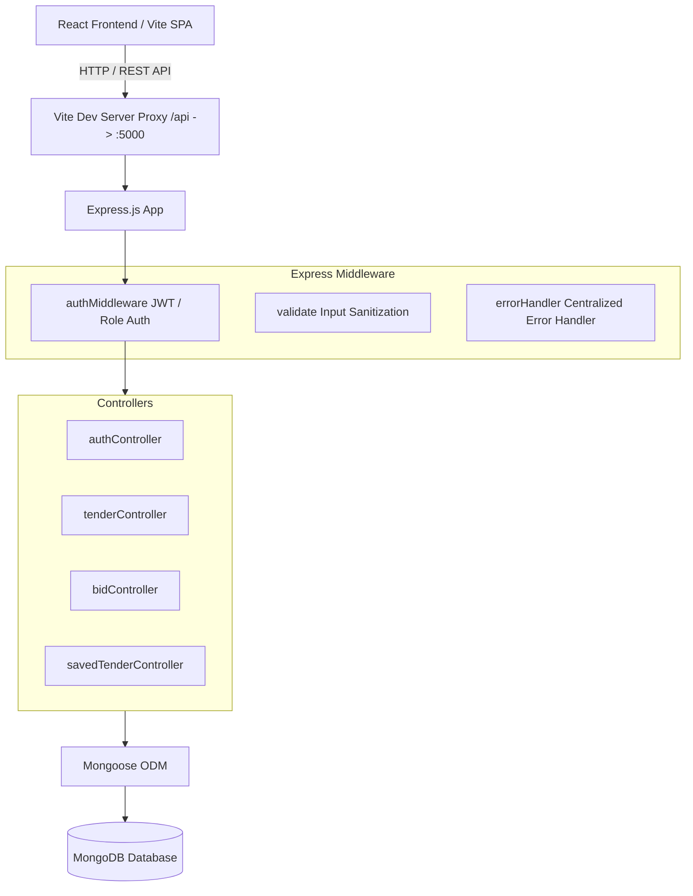

# 📘 Comprehensive System Architecture & API Documentation: TendAI Backend

Welcome to the comprehensive technical documentation for the **TendAI Production Backend**. This documentation details the system architecture, database models, security implementations, REST API specifications, environment setup, database seeding, and integration guidelines with the TendAI React frontend.

---

## 📋 Table of Contents

1. [Executive Summary & Tech Stack](#1-executive-summary--tech-stack)
2. [System Architecture](#2-system-architecture)
3. [Directory & File Structure](#3-directory--file-structure)
4. [Database Schemas & Data Models](#4-database-schemas--data-models)
   - [User Model](#user-model)
   - [Tender Model](#tender-model)
   - [Bid Model](#bid-model)
5. [Authentication & Security Architecture](#5-authentication--security-architecture)
6. [API Specification & Endpoints](#6-api-specification--endpoints)
   - [Authentication API (`/api/auth`)](#authentication-api-apiauth)
   - [Tender API (`/api/tenders`)](#tender-api-apitenders)
   - [Bid API (`/api/bids`)](#bid-api-apibids)
   - [Saved Tenders API (`/api/saved-tenders`)](#saved-tenders-api-apisaved-tenders)
7. [Frontend Integration & Vite Proxy](#7-frontend-integration--vite-proxy)
8. [Database Seeding & Automated Setup](#8-database-seeding--automated-setup)
9. [Environment Configuration & Deployment](#9-environment-configuration--deployment)
10. [Error Handling & Response Specifications](#10-error-handling--response-specifications)

---

## 1. Executive Summary & Tech Stack

**TendAI Backend** is a production-ready RESTful service built with Express.js and MongoDB (Mongoose). It powers a transparent public procurement portal incorporating AI-assisted bid scoring and verifiable mock blockchain transaction audit trails.

### Core Technology Stack:
- **Runtime**: Node.js (ES Modules `import`/`export`)
- **Web Framework**: Express.js (v4.21+)
- **Database & ODM**: MongoDB & Mongoose (v8.9+)
- **Authentication**: JSON Web Tokens (`jsonwebtoken`) & HTTP-only Cookies (`cookie-parser`)
- **Password Hashing**: `bcryptjs` (Salt factor 10)
- **Input Validation**: `express-validator` (v7.2+)
- **CORS Management**: `cors` with origin validation & credential support
- **Environment Management**: `dotenv`

---

## 2. System Architecture



---

## 3. Directory & File Structure

```
TendAI/
├── client/                      # React Frontend Application
│   ├── src/
│   │   ├── services/
│   │   │   └── api.js          # Centralized Axios API client
│   │   └── context/
│   │       └── AuthContext.jsx # Auth Provider & State Persistence
│   └── vite.config.js          # Dev proxy routing /api -> http://localhost:5000
│
└── server/                      # Production Express & MongoDB Backend
    ├── .env                    # Active Environment Configuration
    ├── .env.example            # Environment Configuration Template
    ├── package.json            # Node.js dependencies & scripts
    ├── app.js                  # Express middleware & app initialization
    ├── server.js               # Main entry point & DB connection launcher
    └── src/
        ├── config/
        │   └── db.js           # Mongoose MongoDB connection module
        ├── controllers/
        │   ├── authController.js        # User auth (Register, Login, Me)
        │   ├── tenderController.js      # Tender CRUD, Stats, Admin listing
        │   ├── bidController.js         # Bid submission & evaluation lookups
        │   └── savedTenderController.js # Saved tenders (Bookmarks) management
        ├── middleware/
        │   ├── authMiddleware.js # JWT verification & Role guards (admin/bidder)
        │   ├── errorHandler.js   # Global 404 & Centralized error handler
        │   └── validate.js       # Express-Validator results checker
        ├── models/
        │   ├── User.js         # User Mongoose model
        │   ├── Tender.js       # Tender Mongoose model
        │   └── Bid.js          # Bid Mongoose model
        ├── routes/
        │   ├── authRoutes.js        # Auth endpoint declarations
        │   ├── tenderRoutes.js      # Tender endpoint declarations
        │   ├── bidRoutes.js         # Bid endpoint declarations
        │   └── savedTenderRoutes.js # Saved Tender endpoint declarations
        ├── seeders/
        │   └── seed.js         # Auto-seeder for demo tenders, bids & users
        └── utils/
            └── generateHash.js # Simulated 0x 64-char blockchain hash generator
```

---

## 4. Database Schemas & Data Models

### User Model (`server/src/models/User.js`)
Stores account credentials, role designations, and bookmarked tender references.

```javascript
{
  name: { type: String, required: true, trim: true },
  email: { type: String, required: true, unique: true, lowercase: true, trim: true },
  password: { type: String, required: true, minlength: 6, select: false },
  organisation: { type: String, default: "" },
  role: { type: String, enum: ["bidder", "admin"], default: "bidder" },
  savedTenders: [{ type: String }], // Array of tender custom IDs e.g. "TND-2026-001"
  timestamps: true
}
```

### Tender Model (`server/src/models/Tender.js`)
Stores procurement notices, financial estimates, milestone timelines, and document attachments.

```javascript
{
  id: { type: String, required: true, unique: true, trim: true }, // e.g. "TND-2026-001"
  title: { type: String, required: true, trim: true },
  organisation: { type: String, required: true, trim: true },
  department: { type: String, required: true, trim: true },
  category: { type: String, required: true, trim: true },
  status: { type: String, enum: ["Live", "Closed", "Cancelled"], default: "Live" },
  publishedDate: { type: String, default: "YYYY-MM-DD" },
  closingDate: { type: String, required: true },
  value: { type: Number, required: true },
  emdAmount: { type: Number, required: true },
  description: { type: String, required: true },
  eligibility: { type: String, required: true },
  txHash: { type: String, required: true },
  bidsVisible: { type: Boolean, default: false },
  createdBy: { type: String, default: "admin" },
  creatorUser: { type: mongoose.Schema.Types.ObjectId, ref: "User" },
  documents: [{ type: String }],
  timeline: [
    {
      label: { type: String, required: true },
      timestamp: { type: String, default: null },
      txHash: { type: String, default: "Pending" }
    }
  ],
  timestamps: true
}
```

### Bid Model (`server/src/models/Bid.js`)
Stores submitted bids, financial proposals, AI trust scores, and verification hashes.

```javascript
{
  id: { type: String, required: true, unique: true, trim: true }, // e.g. "BID-901"
  tenderId: { type: String, required: true, trim: true },
  bidder: { type: String, required: true, trim: true },
  user: { type: mongoose.Schema.Types.ObjectId, ref: "User" },
  amount: { type: Number, required: true },
  submittedAt: { type: String, default: "YYYY-MM-DD" },
  status: { type: String, enum: ["Under Evaluation", "Awarded", "Rejected", "Cancelled"], default: "Under Evaluation" },
  trustScore: { type: Number, default: 75 }, // Calculated risk score (0-100)
  txHash: { type: String, required: true },
  timestamps: true
}
```

---

## 5. Authentication & Security Architecture

1. **Password Encryption**:
   - `User.js` pre-save hook automatically hashes plain-text passwords using `bcryptjs` with a cost factor of 10.
   - `matchPassword` method performs secure constant-time hash comparisons.

2. **JWT Token Generation & Transmission**:
   - On successful authentication (Register or Login), the server signs a JWT containing the user's ID:
     ```javascript
     jwt.sign({ id }, JWT_SECRET, { expiresIn: '7d' })
     ```
   - The token is sent in both the JSON payload (`token`) and set as an `httpOnly` secure cookie (`token`).

3. **Protection & Role Authorization Middleware**:
   - `protect`: Extracts JWT from `Authorization: Bearer <token>` header OR `req.cookies.token`. Validates signature and attaches `req.user` (excluding password).
   - `authorize('admin')`: Restricts access to routes strictly to specified roles.

---

## 6. API Specification & Endpoints

### Authentication API (`/api/auth`)

#### `POST /api/auth/register`
- **Access**: Public
- **Request Body**:
  ```json
  {
    "name": "Rajesh Kumar",
    "email": "rajesh@techcorp.in",
    "password": "securepassword123",
    "organisation": "TechCorp Solutions",
    "role": "bidder"
  }
  ```
- **Success Response (`201 Created`)**:
  ```json
  {
    "success": true,
    "token": "eyJhbGciOiJIUzI1NiIsInR5cCI6...",
    "user": {
      "id": "66b3f12a4c9e8f...",
      "name": "Rajesh Kumar",
      "email": "rajesh@techcorp.in",
      "organisation": "TechCorp Solutions",
      "role": "bidder",
      "savedTenders": []
    }
  }
  ```

#### `POST /api/auth/login`
- **Access**: Public
- **Request Body**:
  ```json
  {
    "email": "bidder@tendai.gov.in",
    "password": "bidderpassword123",
    "role": "bidder"
  }
  ```
- **Success Response (`200 OK`)**:
  ```json
  {
    "success": true,
    "token": "eyJhbGciOiJIUzI1...",
    "user": { ... }
  }
  ```

#### `GET /api/auth/me`
- **Access**: Private (Authenticated)
- **Headers**: `Authorization: Bearer <JWT_TOKEN>`
- **Success Response (`200 OK`)**:
  ```json
  {
    "success": true,
    "user": {
      "id": "66b3f12a4c9e8f...",
      "name": "Enterprise Bidder",
      "email": "bidder@tendai.gov.in",
      "organisation": "Your Organisation",
      "role": "bidder",
      "savedTenders": ["TND-2026-001", "TND-2026-002"]
    }
  }
  ```

---

### Tender API (`/api/tenders`)

#### `GET /api/tenders`
- **Access**: Public
- **Query Parameters**:
  - `category`: String (e.g. `Infrastructure`, `IT Services`)
  - `status`: String (`Live`, `Closed`, `Cancelled`)
  - `department`: String (e.g. `Renewable Energy`)
  - `valueRange`: String (e.g. `0-100000000`)
  - `search`: String (searches ID, title, organisation, category)
  - `sortBy`: String (`closingDate`, `publishedDate`, `value`)
- **Success Response (`200 OK`)**:
  ```json
  {
    "success": true,
    "count": 8,
    "data": [
      {
        "id": "TND-2026-001",
        "title": "Smart Water Metering Infrastructure for Jaipur Urban Zone",
        "organisation": "Department of Urban Development, Rajasthan",
        "department": "Urban Development",
        "category": "Infrastructure",
        "status": "Live",
        "publishedDate": "2026-07-01",
        "closingDate": "2026-08-08",
        "value": 185000000,
        "emdAmount": 925000,
        "description": "Procurement, installation, and maintenance of IoT-enabled water meters...",
        "eligibility": "Minimum five years of municipal infrastructure delivery experience...",
        "txHash": "0x7a9f3b22e14d8a09c7f31a37f72d91ef44d199aac5a80e20c124d191b011901a",
        "bidsVisible": false,
        "documents": ["Notice Inviting Tender.pdf", "Technical Specification.pdf", "BoQ.xlsx"]
      }
    ]
  }
  ```

#### `GET /api/tenders/stats`
- **Access**: Public
- **Success Response (`200 OK`)**:
  ```json
  {
    "success": true,
    "data": {
      "totalTenders": 8,
      "activeBidders": 1284,
      "awardedTenders": 2
    }
  }
  ```

#### `GET /api/tenders/:id`
- **Access**: Public
- **URL Parameter**: `id` = `TND-2026-001` or ObjectId
- **Success Response (`200 OK`)**:
  ```json
  {
    "success": true,
    "data": {
      "id": "TND-2026-001",
      "title": "Smart Water Metering Infrastructure...",
      "description": "...",
      "timeline": [ ... ],
      "bids": []
    }
  }
  ```

#### `POST /api/tenders`
- **Access**: Private (Admin Only)
- **Request Body**:
  ```json
  {
    "title": "Statewide Highway CCTV Network",
    "description": "Procurement and installation of automated speed cameras...",
    "category": "Infrastructure",
    "department": "Transport",
    "organisation": "National Highways Authority",
    "closingDate": "2026-09-30",
    "emdAmount": 500000,
    "value": 45000000,
    "eligibility": "Prior highway CCTV deployment experience."
  }
  ```

---

### Bid API (`/api/bids`)

#### `POST /api/bids`
- **Access**: Private (Bidder Only)
- **Request Body**:
  ```json
  {
    "tenderId": "TND-2026-001",
    "amount": 182000000
  }
  ```
- **Success Response (`201 Created`)**:
  ```json
  {
    "success": true,
    "message": "Bid submitted successfully with AI trust scoring and on-chain verification",
    "data": {
      "id": "BID-941",
      "tenderId": "TND-2026-001",
      "bidder": "Your Organisation",
      "amount": 182000000,
      "submittedAt": "2026-08-07",
      "status": "Under Evaluation",
      "trustScore": 88,
      "txHash": "0xa6f7c9e0..."
    }
  }
  ```

#### `GET /api/bids/my-bids`
- **Access**: Private (Bidder Only)
- **Success Response (`200 OK`)**: Returns array of bids submitted by current user.

---

### Saved Tenders API (`/api/saved-tenders`)

#### `GET /api/saved-tenders`
- **Access**: Private (Bidder Only)
- **Success Response (`200 OK`)**: Returns saved tender IDs and full tender details.

#### `POST /api/saved-tenders/:tenderId`
- **Access**: Private (Bidder Only)
- **Success Response (`200 OK`)**: Toggles tender in user's saved list and returns updated list.

---

## 7. Frontend Integration & Vite Proxy

The React frontend accesses the Express backend seamlessly via an Axios client and Vite development proxy:

### `client/vite.config.js`
```javascript
export default defineConfig({
  plugins: [react()],
  server: {
    port: 5173,
    proxy: {
      "/api": {
        target: "http://localhost:5000",
        changeOrigin: true,
        secure: false
      }
    }
  }
});
```

---

## 8. Database Seeding & Automated Setup

The backend includes an automatic seeder (`server/src/seeders/seed.js`). When `server.js` boots:
1. It checks if the `tenders` collection is empty. If empty, it populates all 8 initial mock tenders.
2. It populates initial mock bids.
3. It creates default demo user accounts:
   - **Admin Officer**: `admin@tendai.gov.in` / `adminpassword123`
   - **Bidder**: `bidder@tendai.gov.in` / `bidderpassword123`

You can manually trigger database re-seeding at any time:
```bash
cd server
npm run seed
```

---

## 9. Environment Configuration & Deployment

### `.env` File (`server/.env`):
```env
PORT=5000
MONGO_URI=mongodb://127.0.0.1:27017/tendai
JWT_SECRET=tendai_super_secret_jwt_key_2026_production_v1
JWT_EXPIRES_IN=7d
CLIENT_URL=http://localhost:5173
NODE_ENV=development
```

### Steps to Run:
```bash
# 1. Open Terminal in server directory
cd server

# 2. Install dependencies
npm install

# 3. Launch Development Server with auto-watch
npm run dev

# Or Launch Production Server
npm start
```

---

## 10. Error Handling & Response Specifications

All API errors return consistent JSON responses with appropriate HTTP status codes:

```json
{
  "success": false,
  "message": "Descriptive error message describing cause of failure",
  "stack": null
}
```

### Handled HTTP Status Codes:
- `200 OK`: Successful query or update operation.
- `201 Created`: Successful creation of User, Tender, or Bid.
- `400 Bad Request`: Missing parameters, validation failure, or duplicate key.
- `401 Unauthorized`: Missing, invalid, or expired JWT token.
- `403 Forbidden`: Authenticated user lacks required role permissions.
- `404 Not Found`: Requested tender, bid, or user resource does not exist.
- `500 Internal Server Error`: Server exception handled by global error middleware.
